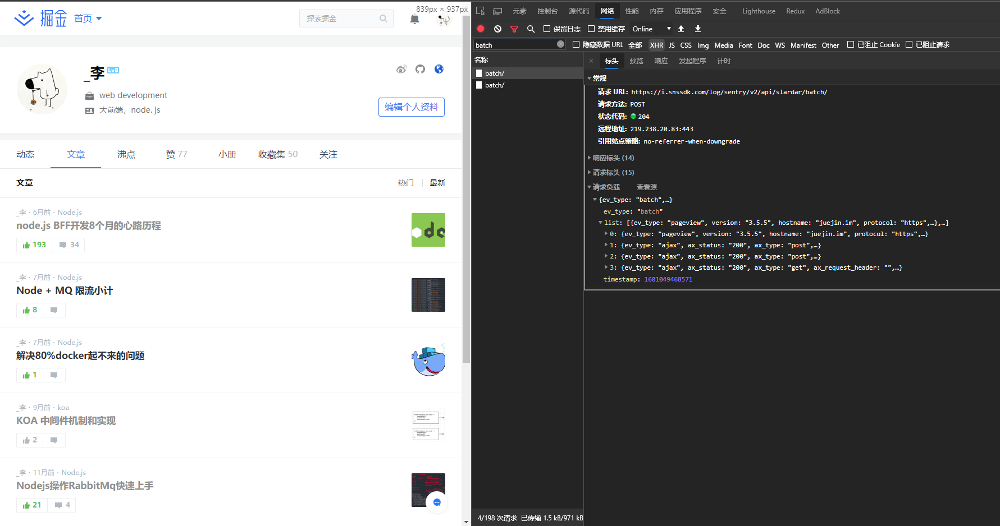
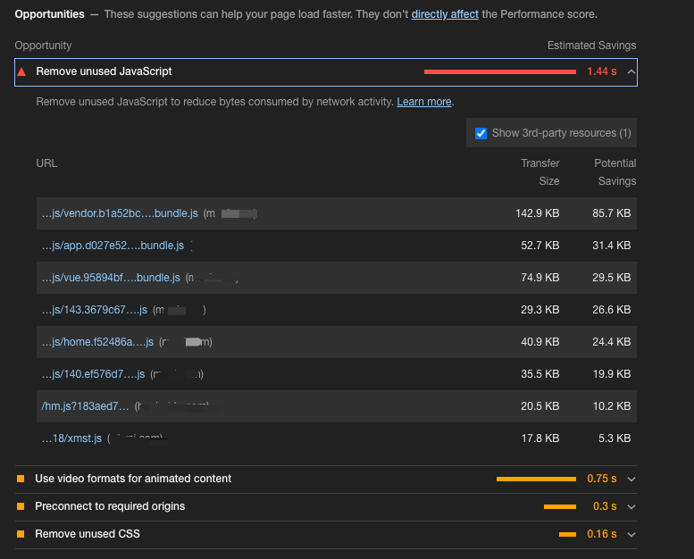
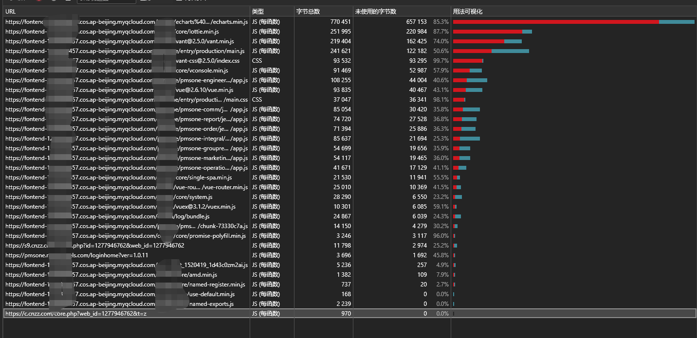

# 浏览器网站性能分析

<!-- 学了一堆的性能优化技巧以后，你的网站实实在在变快了吗？ 变快了多少？  
在学习一波如何分析网站性能吧！ -->

网站性能是一个老生常谈的问题，但是这块又不是一件简简单单好干的事情，需要一点点啃，最近啃了一下，然后发现中间还是有东西的，过来分享一下。

我把这块分为两个事情。

1.  别人的性能
2.  开发调试的性能

## 别人的性能

这个别人指的是“自己的程序在别人的设备上运行的性能”。
这个性能非常有必要知道，比如“客户和你吐槽说：你这个程序好慢啊，能不能快一点”，平时我们一般都用 chrome 在 PC 上做开发，心想，“我每天打开，平均也就在`1~2S`左右，一点也不慢”，无论客户怎么解释，你掏出自己的手机，依旧非常快，于是客户录了个屏给你。确实是非常慢，这个时候你的内心是崩溃的。

所以这里需要通过`window.performance`来上报性能。这里有很多可以操作的方式，就不具体说了，但是一定要做(以及错误监控)。

看图学习

## 自己的性能

当我们还在开发的时候，上线之前，最好是自己测一下性能，一方面是做性能测试，一方面（性能+bug）≈ 个人能力，和公司地位,每天 bug 不断，旁边同事都快不好意思认识你了不是。

### 使用`chrome`的工具`audits`（现在叫`lighthouse`）来看看性能评测和建议

点开生成报告

得到以下结果

76 分，看起来还算及格，但是还是有一些黄色的点，可以仔细看看

> 可能在不同设备，不同网络下得分不同，侧重点在建议和优化上

首先下面有六个条目,点击 `metrics `的右边可以切换这些时间都是怎么来的，以及怎么优化，有一个学习更多，这块不做更多描述。

然后咱们可以看看具体建议。

- `Eliminate render-blocking resources` 御姐节约`1.36s`

> "资源阻塞了页面的第一次绘制。考虑以内联方式交付关键的 JS/CSS，而推迟所有非关键的 JS/样式"

描述的已经很详细了：

1.  资源阻塞了第一次绘制，需要优化
2.  考虑内联加载关键样式
3.  延迟加载非关键样式

- `Enable text compression`
  > "基于文本的资源应该通过压缩(gzip、deflate 或 brotli)来最小化总网络字节数。"
  >
  > 1.  可以开启`gzip`进行压缩，减少传输的字节

... 第三项跳过,看第四项,和我后用用到的方式有关系

- `Remove unused JavaScript`

> "移除没有用到的 JavaScript"
> 

已经具体列出了文件，就非常 nice。

1.  分析自己用到的包，尝试找到一种方法，只从其中导入所需的组件。
2.  tree-shaking

具体的方式，可以看下一个分析手段。

沿着这个思路，一项一项的分析...，如果遇到不会的，展开以后，有一个`learn more`，看到了吗，点它。

### 使用`coverage`工具来看代码冗余程度方便做`tree-shaking`

这是个隐藏工具，就藏在`Chrome`体内，不需要安装任何东西，只需要`Command+Option+J` 然后输入`coverage`就可以看到了

然后需要点击一下重新载入，就可以看到了这样的面板(我这里用的是 Edge，Chrome 8G 不能打)。

看一下这个，非常吓人了吧~ 85 %的代码是用不到的，有的三方库是提供了好几个版本的，比如`xxx-min.js`，或者`xxx-runtime.js`或者`xxx-core.js`，看到现在的这些无效的数字，可以考虑，重新选一下了

**这里再提示一下：如果真的开始优化的话，优化完之后，最好是再评测一下，试试是否是朝着正确的方向在走。**

### 使用`performance`面板分析性能分析具体性能

这是三个方式中最复杂的一项了，希望大家都能耐心坚持看。

先来简单看一张面板介绍的图(图片来自网络)

开始分析，点击图的左上角的第二个刷新的小按钮"重新载入并分析"。

然后载入完成后可以点击第一个按钮停止

会得到一下面这样的数据，不着急，一点点看。

首先看看摘要的：

脚本执行 650 毫秒  
- 27ms 渲染  
- 07ms 绘制  
- 1196 是空闲  

看起来首次绘制没有特别大的性能问题，但是上面的 fps 面板还是红色，这块可以分析一下，调整时间的边界，只看一小块时间发生的事。

选择以后，看`main`轴，有一个任务出现了红色，鼠标点击出现了具体信息，长任务耗时 54.67（这里我看过了 chrome 的建议）大于 50ms 都算长任务了，然后切换自下而上（就是调用栈反过来，通常来说栈底是触发的方法，栈顶是最深的方法）。

可以看到各个函数具体的执行时间，但是这块是框架主体部分，然后就可以点开具体代码去做优化了。

然后可以再来分析一下具体业务耗时大的

这个地方，是一个长列表，出现了红色的频率抖动，仔细看了一下，栈底是一个定时器。指定达到了 55.7ms，然后这块肯定是有一点问题的（还是长任务问题）

**这里说一下长任务是什么？为什么会出现 长任务？**

- **任务**: `task` 一帧的计算为一个`task`

> 我们玩 LOL 的时候，右上角的`FPS帧率`通常在`100+`，说的就是 `1s/100+`，如果掉到了`20+`，是一种什么体验，不用我多说了。  
> 现在的设备基本上是`60fps+`,如果需要做到`60fps`，`1000/60=16.66ms`。  
> 记得在哪里看过最大`50ms`,如果达到 50ms 才能生成一个帧，那就 `1000 / 50 = 20fps`，这个是在 PC 上的，手机上可能会更慢~

*对了，最近还有120fps的手机*

最后感叹一下，虚拟dom的性能确实不错，就算不做特别多的代码层面的性能优化，依旧还是有不错的性能表现。

额。我好像透漏了什么..

- 我们目前主要做了大层面的网络优化！！ cdn + 微前端 + bff层   
- bff层看到的数据（95的接口都在800ms内完成响应）

到了这里，基本上就大概知道了自己的应用出现了那些性能瓶颈，可以去找找，然后尝试着解决吧！

> 最后，写作不易，如果大家有收获的话点个赞或者留个言吧。  
> 希望大家都能成为自己想要的样子!
