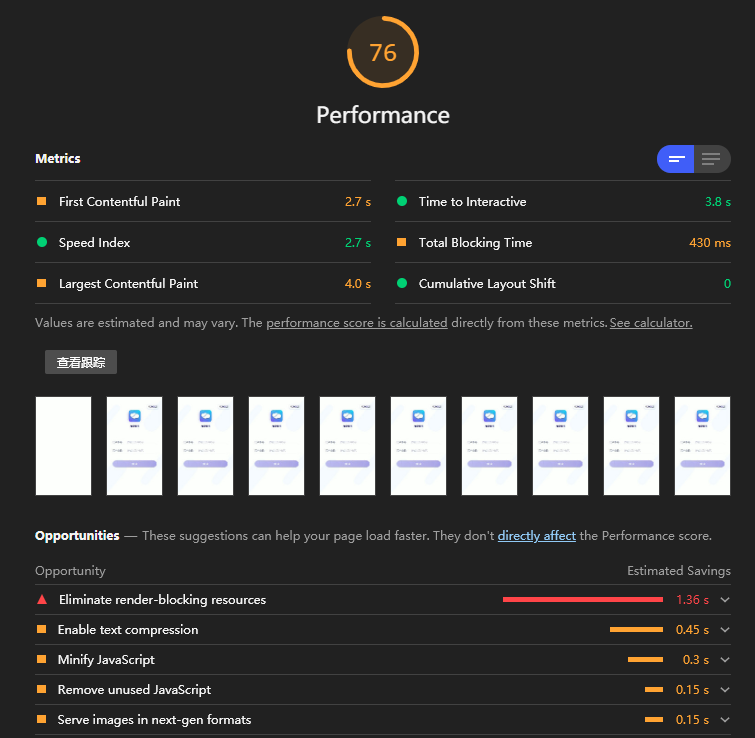

# 浏览器网站性能分析

学了一堆的性能优化技巧以后，你的网站实实在在变快了吗？  
在学习一波如何分析网站性能吧！

网站性能是一个老生常谈的问题，但是这块又不是一件简简单单好干的事情，需要一点点啃，最近啃了一下，然后发现中间还是有东西的，过来分享一下。

## 我把这块分为两个事情。

1. 别人的性能
   这个别人指的是“自己的程序在别人的设备上运行的性能”。
   这个性能非常有必要知道，比如“客户和你吐槽说：你这个程序好慢啊，能不能快一点”，平时我们一般都用 chrome 在 PC 上做开发，心想，“我每天打开，平均也就在`1~2S`左右，一点也不慢”，无论客户怎么解释，你掏出自己的手机，依旧非常快，于是客户录了个屏给你。确实是非常慢，这个时候你的内心是崩溃的。

解决办法：使用 sentry

## 自己的性能

当我们还在开发的时候，上线之前，最好是自己测一下性能，一方面是做性能测试，一方面（性能+bug）≈ 个人能力，和公司地位,每天 bug 不断，旁边同事都快不好意思认识你了不是。

### 使用`chrome`的工具`audits`（现在叫`lighthouse`）来看看性能评测和建议

点开生成报告

得到以下结果

> ps：这不是我们的项目，随便找的一个网站。如果得分相同，纯属巧合[狗头]
> 还有一点，这个是别人的网站，不拿

53分，有很多的优化空间,一点一点的看。

首先下面有六个条目,点击metrics 的右边可以切换这些时间都是怎么来的，以及怎么优化，有一个学习更多，这块不做更多描述。

然后咱们可以看看具体建议。

### 使用`coverage`工具来看代码冗余程度方便做`tree-shaking`

3.
