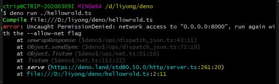

# 几个小例子助你入门deno


## hello wrold
新建`hello.ts`

```ts
import { serve } from 'https://deno.land/std@0.50.0/http/server.ts';
const s = serve({ port: 8000 });
console.log('http://localhost:8000/');
console.log(s);
for await (const req of s) {
  req.respond({ body: 'Hello World\n' });
}
```

`deno run ./hello.ts`
首先会执行下载 `std@0.50.0/http/server`相关的东西

然后会给你抛出一个异常,`你没有权限监听8000端口，如果需要你可以使用 --allow-net`


`deno run --allow-net ./hello.ts`
成功运行，可以看到一个hello wrold在等着你


## webserver
尝试一把使用`deno`返回html文件，成为一个webserver

按照`deno`的哲学，咱先确定一下需要哪些权限
- net
- file

准备开始动手写代码，发现官网已经封装好了，直接run 就完事了.这可真的`nice`
```js
deno install --allow-net --allow-read https://deno.land/std/http/file_server.ts
```

作为当代优秀后浪，不手动实现一下，怎么能安心呢


## 3.json


## 4.mysql